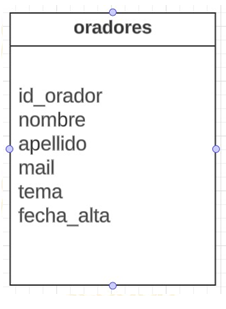
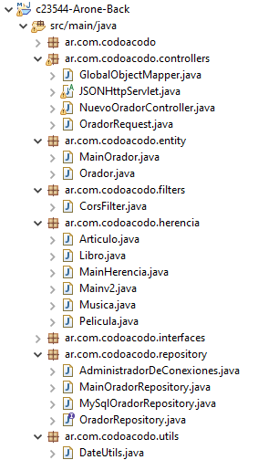

# Comisión 23544 - Martes y jueves 20:30 a 22:00 hs
---
## Trabajo Integrador Front-End del Curso Full-Stack JAVA. 
### Realizado por Cecilia G. Arone 
---
### Octubre 2023
---
El trabajo está constituido en varias partes.
La primera se compone en replicar lo mejor posible la página web utilizando Bootstrap de la imagen que se muestra a continuación. Hacerla responsive.
 

---
La segunda parte del trabajo comprende una nueva sección que al presionar el enlace "tickets" se debe replicar la figura siguiente, que deberá contener la funcionalidad en JS, al momento de presionar en el botón "Resumen, deberá mostrar en la sección "Total a Pagar: $" el monto correspondiente a la cantidad de tickets a comprar con el descuento correspondiente dependiendo la categoría seleccionada. Existen 3 categorías: Estudiante,Trainee, Junior. 
 

---
La tercera parte del trabajo abarca la creación de una base de datos de oradores en el motor MySql.
Se deberá crear una base de datos llamada “integrador_cac” y crear la siguiente tabla llamada “oradores”:
 

* Definir los tipos de datos correspondientes
* Definir la clave primaria correspondiente
* Definir las restricciones correspondientes
* Insertar 10 registros
* Hacer un backup de la base de datos
 
La entrega deberá ser subiendo el Backup de la base de datos, una captura de la estructura de la tabla y una captura de los registros insertados a un repositorio de Github y luego compartir el enlace.
---
La cuarta parte del trabajo consta de la entrega del esqueleto de la parte de back-end realizada en lenguaje java.
 
---
La quinta parte se conforma por la integración de todas las partes anteriores y se deberá agregar una sección en donde se muestren los datos traídos de la base de datos creada en MySql de los oradores que van a dar la conferencia.
 
El objetivo es mostrar en un formato tipo tabla todos los registros creados en una tabla de tu BD diseñada previamente.
La entrega deberá realizarse en formato video donde se muestre en como máximo de 3 minutos la funcionalidad de la aplicación.
